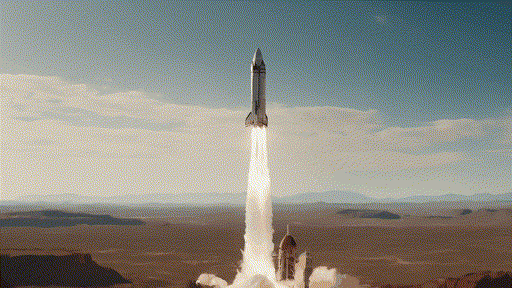
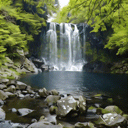
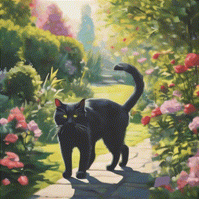
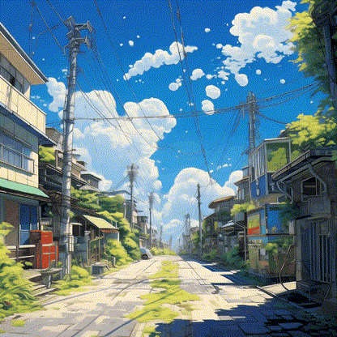

# CamTrol: Training-free Camera Control for Video Generation

This repository is unofficial implementation of [CamTrol: Training-free Camera Control for Video Generation](https://lifedecoder.github.io/CamTrol/), based on SVD.

Some videos generated through SVD:
<table class="center">
    <tr>
    <td width=25% style="border: none"></td>
    <td width=25% style="border: none"></td>
    <td width=25% style="border: none"></td>
    <td width=25% style="border: none"></td>
    </tr>
</table>

## Setup

1. `pip install -r requirement.txt`

2. Download SVD checkpoint [svd.safetensors](https://huggingface.co/stabilityai/stable-video-diffusion-img2vid/tree/main) and set its path at `ckpt_path` in `sgm/svd.yaml`.

3. Clone depth estimation model: `git clone https://github.com/isl-org/ZoeDepth.git`


The code downloads [stable-diffusion-inpainting](https://huggingface.co/runwayml/stable-diffusion-inpainting) and [open-clip](https://github.com/mlfoundations/open_clip) automatically, you can set to your path if they're already done.

## Sampling
```
CUDA_VISIBLE_DEVICES=0 python3 sampling.py \
                    --input_path "assets/images/street.jpg" \
                    --prompt "a vivid anime street, wind blows." \
                    --neg_prompt " " \
                    --pcd_mode "hybrid default 14 out_left_up_down" \
                    --add_index 12 \
                    --seed 1 \
                    --save_warps False \
                    --load_warps None
```

- `pcd_mode`: camera motion for point cloud rendering, a string concat by four elements. For each element, the first defines camera motion, the second defines moving distance or angle, the third defines number of frames, the last defines moving direction. You can load any camera extrinsics matrices in `complex` mode, and set bigger `add_index` for better motion alignment.
- `prompt`, `neg_prompt`: as SVD doesn't support text input, these mainly serve for stable diffusion inpainting.
- `add_index`: t_0 in the paper, balancing trade-off between motion fidelity and video diversity. Set between `0` and `num_frames`, the bigger the more faithful video aligns to camera motion.
- `save_warps`: whether save multi-view renderings, you can reload the already-rendered images as this process might takes some time. Use low-res images to boost speed.
- `load_warps`: whether load renderings from `save_warps` or not.


## Backbones
I used SVD in this repository. You can use it on your customized video diffusion model.

## Acknowledgement
The code is majorly founded on [SVD](https://github.com/Stability-AI/generative-models/tree/main) and [LucidDreamer](https://github.com/luciddreamer-cvlab/LucidDreamer).
